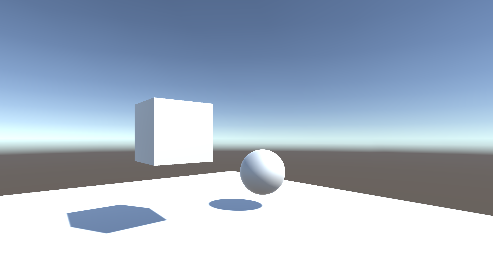
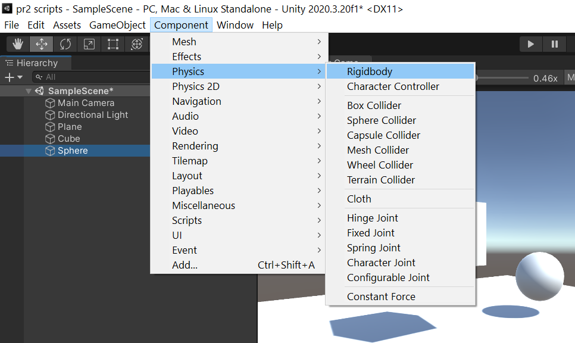
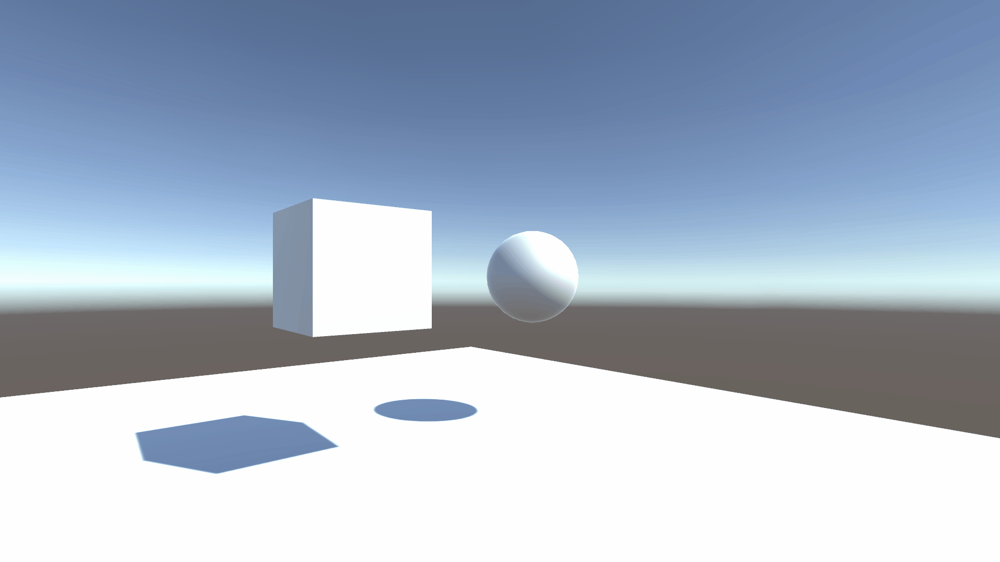
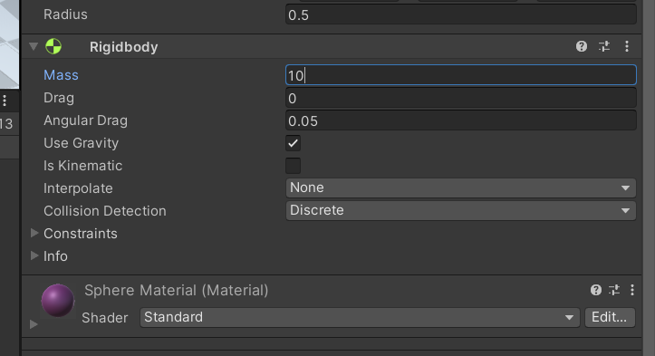
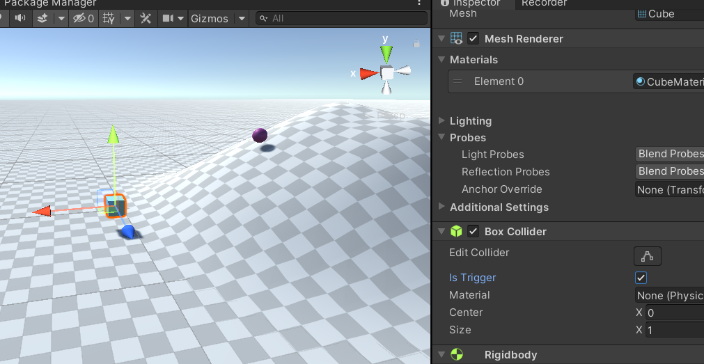

# Práctica 2: Introducción a los scripts en Unity
* **Asignatura:** Interfaces Inteligentes
* **Autora:** Vanessa Valentina Villalba Pérez
* **Correo:** alu0101265704@ull.edu.es

## **Objetivos de la práctica y pasos realizados** 
1. **Crear una escena simple sobre la que probar diferentes configuraciones de objetos físicos en Unity. La escena debe tener un plano a modo de suelo, una esfera y un cubo.**
   
    a. **Ninguno de los objetos será físico**

    Al no tener activado el *RigidBody*, no responden a la gravedad y durante la escena se quedan estáticos aunque se encuentren en una posición alejada al plano.

    

    b. **La esfera tiene físicas, el cubo no**

    Para añadirle físicas a la esfera es tan sencillo como después de seleccionar el objeto esfera, ir a la barra superior, seleccionar la opción **Component>Physics>RigidBody**

    

    De esta manera veremos en el inspector cómo se le ha añadido el nuevo component al objeto y que la opción *Use Gravity* se encuentra activada, por lo que la esfera al ser colocada inicialmente por encima del plano, caerá.

    

    c. **La esfera y el cubo tienen físicas**

    Tal y como se comentó en el apartado anterior, al añadir el component RigidBody los objetos tendrán gravedad.

    

    Adicionalmente, como se ve en el siguiente GIF, por defecto todos los objetos vienen dados con una masa igual a 1, por lo que si colisionan entre sí no se moverían demasiado.
 
    

    d. **La esfera y el cubo son físicos y la esfera tiene 10 veces la masa del cubo**

    Para cambiar la masa de los objetos que tengan el component RigidBody activado, en el inspector se podrá tan solo modificando la cifra que aparece en *mass*.

    

    A diferencia del apartado anterior, al aumentar la masa de la esfera a 10 (ya que el cubo es de masa igual a 1) al momento de colisionar, el cubo, en este caso, se mueve mucho más, ya que la esfera es más pesada.
    
    

    e. **La esfera tiene físicas y el cubo es de tipo IsTrigger**

    En el inspector, en el apartado de *Box Collider* se activa la opción de *IsTrigger*.

    

    Ahora, lo que sucede es que al colisionar y que al menos uno de los objetos tenga activada esta opción, realmente no se chocan entre sí los objetos. Incluso, la esfera es capaz de atravesar el cubo sin mayor inconveniente.

    

    f. **La esfera tiene físicas, el cubo es de tipo IsTrigger y tiene físicas**

    En este caso, lo que sucede es que al cubo contar con físicas, considera la gravedad y, como fue explicado en el apartado anterior tampoco colisiona. Entonces, lo que sucede es que al soltar el cubo cae al vacío del metaverso.

    
    
    g. **La esfera y el cubo son físicos y la esfera tiene 10 veces la masa del cubo, se impide la rotación del cubo sobre el plano XZ**

    En el caso en el que no se haya bloqueado la rotación sobre el plano XZ, el cubo se comporta como lo ha venido haciendo hasta ahora, siguiendo las leyes de la gravedad normalmente al caer de la colina.

    

    Sin embargo, luego, al bloquear dicha rotación se puede observar cómo el cubo es incapaz de caer rodando como lo hacía en el GIF anterior ya que el plano XZ para la rotación está bloqueado. Para realizar esta configuración es tan sencillo como ir al Inspector y, dentro de las opciones que te da el component *RigidBody* seleccionar las restricciones *Constraints* y, seleccionar las casillas para *Freeze Rotation* que interesen.

    
