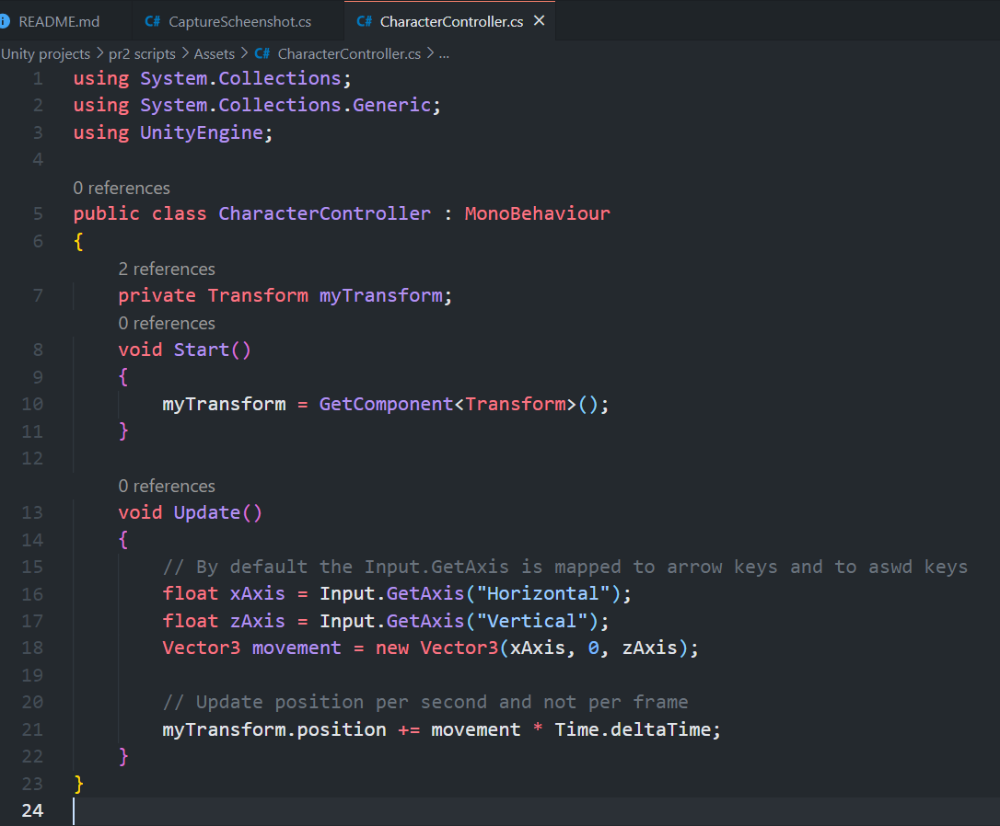
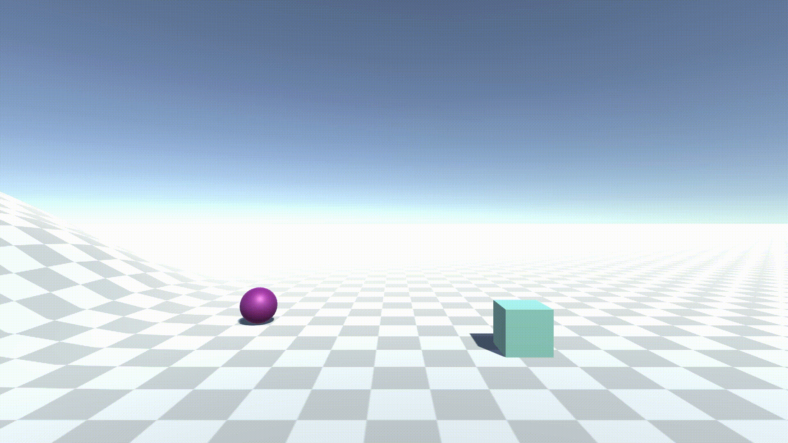
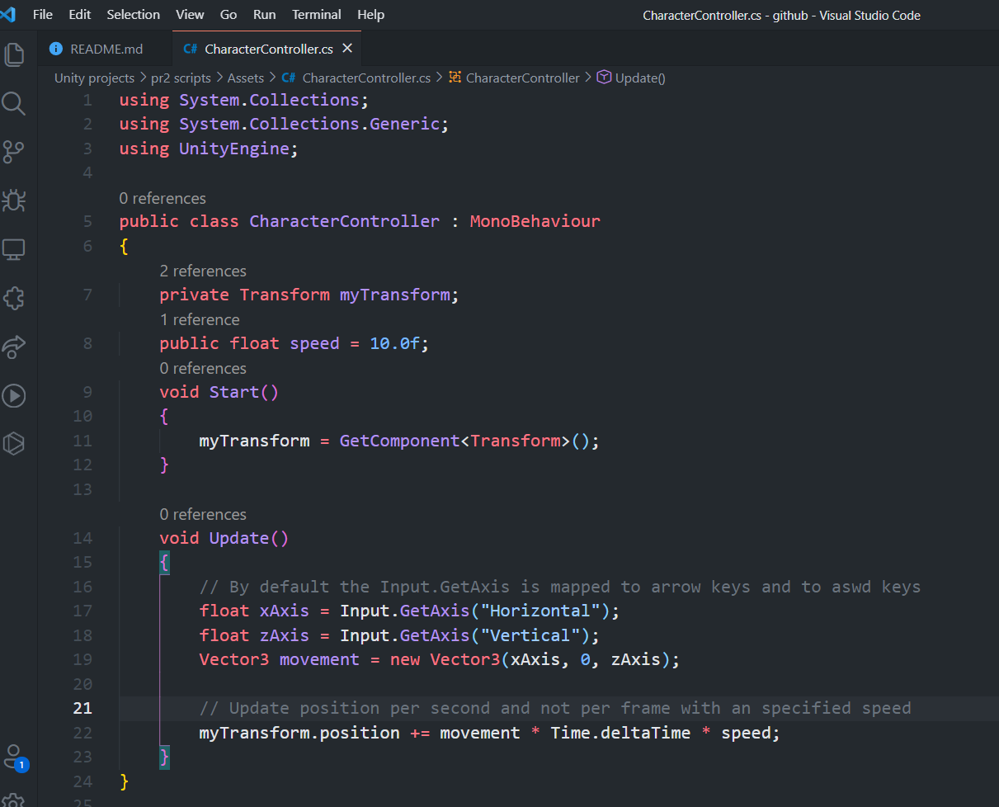
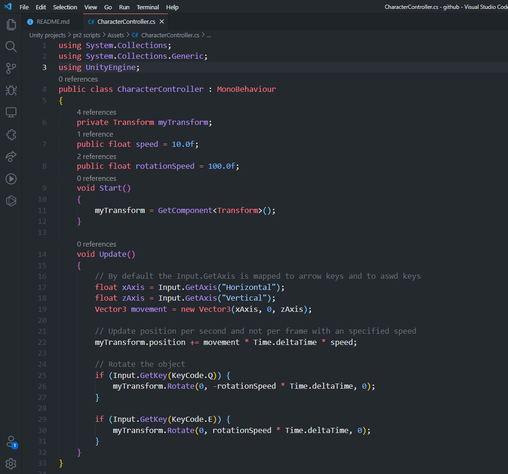
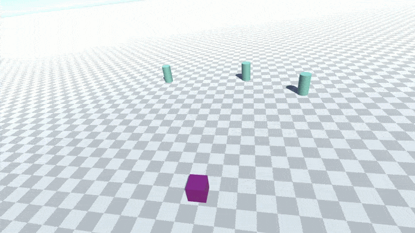
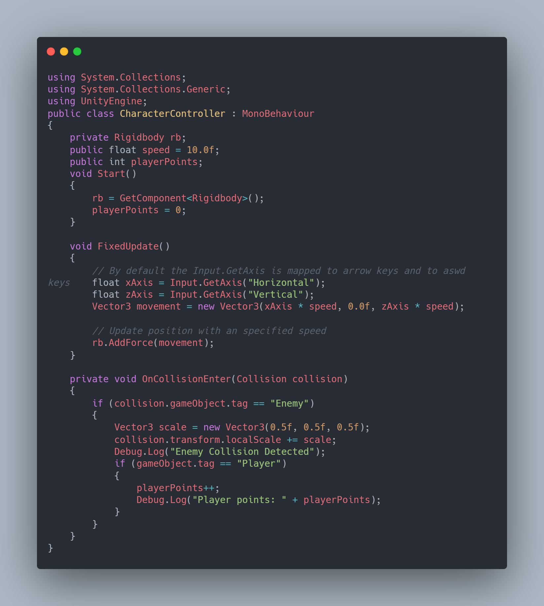
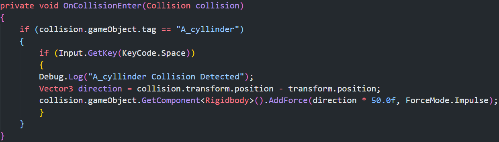
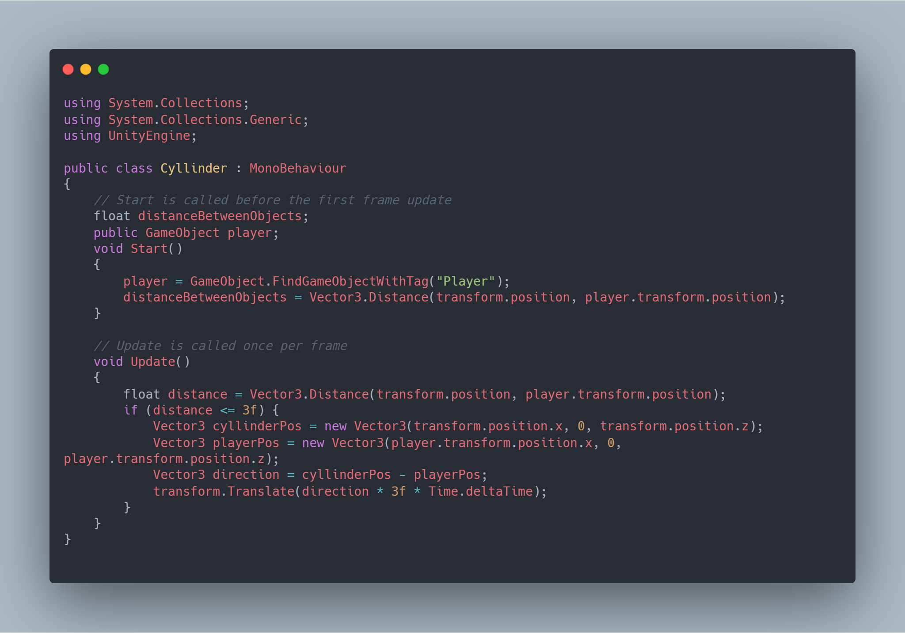
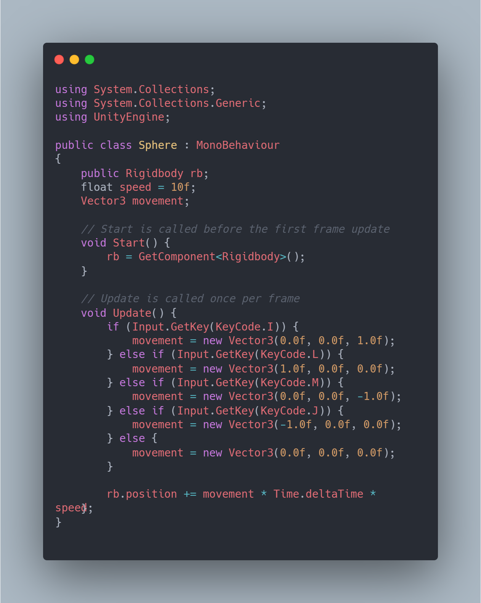

# Práctica 2: Introducción a los scripts en Unity
* **Asignatura:** Interfaces Inteligentes
* **Autora:** Vanessa Valentina Villalba Pérez
* **Correo:** alu0101265704@ull.edu.es

## **Objetivos de la práctica y pasos realizados**

**IMPORTANTE:** Los scripts que se encuentran subidos al GitHub, hacen referencia al último ejercicio de todos, ya que a lo largo de la práctica se fue modificando el código en los mismos ficheros.

1. **Crear una escena simple sobre la que probar diferentes configuraciones de objetos físicos en Unity. La escena debe tener un plano a modo de suelo, una esfera y un cubo.**
   
    a. **Ninguno de los objetos será físico**

    Al no tener activado el *RigidBody*, no responden a la gravedad y durante la escena se quedan estáticos aunque se encuentren en una posición alejada al plano.

    

    b. **La esfera tiene físicas, el cubo no**

    Para añadirle físicas a la esfera es tan sencillo como después de seleccionar el objeto esfera, ir a la barra superior, seleccionar la opción **Component>Physics>RigidBody**

    

    De esta manera veremos en el inspector cómo se le ha añadido el nuevo component al objeto y que la opción *Use Gravity* se encuentra activada, por lo que la esfera al ser colocada inicialmente por encima del plano, caerá.

    

    c. **La esfera y el cubo tienen físicas**

    Tal y como se comentó en el apartado anterior, al añadir el component RigidBody los objetos tendrán gravedad.

    

    Adicionalmente, como se ve en el siguiente GIF, por defecto todos los objetos vienen dados con una masa igual a 1, por lo que si colisionan entre sí no se moverían demasiado.
 
    

    d. **La esfera y el cubo son físicos y la esfera tiene 10 veces la masa del cubo**

    Para cambiar la masa de los objetos que tengan el component RigidBody activado, en el inspector se podrá tan solo modificando la cifra que aparece en *mass*.

    

    A diferencia del apartado anterior, al aumentar la masa de la esfera a 10 (ya que el cubo es de masa igual a 1) al momento de colisionar, el cubo, en este caso, se mueve mucho más, ya que la esfera es más pesada.
    
    

    e. **La esfera tiene físicas y el cubo es de tipo IsTrigger**

    En el inspector, en el apartado de *Box Collider* se activa la opción de *IsTrigger*.

    

    Ahora, lo que sucede es que al colisionar y que al menos uno de los objetos tenga activada esta opción, realmente no se chocan entre sí los objetos. Incluso, la esfera es capaz de atravesar el cubo sin mayor inconveniente.

    

    f. **La esfera tiene físicas, el cubo es de tipo IsTrigger y tiene físicas**

    En este caso, lo que sucede es que al cubo contar con físicas, considera la gravedad y, como fue explicado en el apartado anterior tampoco colisiona. Entonces, lo que sucede es que al soltar el cubo cae al vacío del metaverso.

    
    
    g. **La esfera y el cubo son físicos y la esfera tiene 10 veces la masa del cubo, se impide la rotación del cubo sobre el plano XZ**

    En el caso en el que no se haya bloqueado la rotación sobre el plano XZ, el cubo se comporta como lo ha venido haciendo hasta ahora, siguiendo las leyes de la gravedad normalmente al caer de la colina.

    

    Sin embargo, luego, al bloquear dicha rotación se puede observar cómo el cubo es incapaz de caer rodando como lo hacía en el GIF anterior ya que el plano XZ para la rotación está bloqueado. Para realizar esta configuración es tan sencillo como ir al Inspector y, dentro de las opciones que te da el component *RigidBody* seleccionar las restricciones *Constraints* y, seleccionar las casillas para *Freeze Rotation* que interesen.

    

2. **Sobre la escena que has trabajado ubica un cubo que represente un personaje que vas a mover. Se debe implementar un script que haga de CharacterController. Cuando el jugador pulse las teclas de flecha (o aswd) el jugador se moverá en la dirección que estos ejes indican**
   
    a. **Crear un script para el personaje que lo desplace por la pantalla, sin aplicar simulación física**

    Antes de continuar, siguiendo con las configuraciones del primer apartado, debemos eliminar las físicas del cubo, para poder hacer uso del *Transform*.

    Luego, creamos un script *CharacterController* donde se crea un objeto del tipo transform que va a ser utilizado para actualizar las posiciones al acceder a *myTransform.position*. Además, se obtienen los ejes X y Z del momento para crear un Vector3 el cual va a ser utilizado para mover el objeto, y lo multiplicaremos por el *Time.deltaTime* para que se actualice el movimiento por cada segundo que pasa.

    

    Importante saber que, el Input.GetAxis(AxisName) devolverá el valor del eje virtual correspondiente a AxisName, que estará comprendido en un rango entre el -1 y el 1. Y, que también se encuentra asociado a las flechas del teclado y aswd, por lo que se encuentra en constante escucha.

    

    b. **Agregar un campo público que permita graduar la velocidad del movimiento desde el inspector de objetos**

    Al mismo fichero con el que trabajamos anteriormente, le añadimos una asignación de la variable *speed* y ésta a su vez la multiplicamos en la posición del objeto transform, para que no solamente considere el tiempo sino la velocidad del objeto. 

    

    Adicionalmente, al hacer esto se añade una configuración nueva en el inspector, que permite cambiar dicha velocidad para ejecutarlo, sin necesidad de cambiarlo en el script.

    

    

    c. **Estar a la escucha de si el usuario ha utilizado los ejes virtuales. Elegir cuáles se va a permitir utilizar: flechas, aswd.**

    Tal y como se explicó en el apartado 2.a, ya el Input.GetAxis viene mapeado por defecto con ambas alternativas, por lo que el usuario libremente podrá usar cualquiera de las dos durante una misma ejecución y funcionará por igual para las flechas como para aswd.

    d. **Elegir otros ejes virtuales para el giro y girar al jugador sobre el eje OY(up).**

    Añadimos una velocidad de giro y, directamente se hace uso del *Transform.rotate* donde solo se le da valores al eje Y a partir de la velocidad multiplicada con el tiempo. Y, para reconocer el input se asignaron las teclas Q y E, para las rotaciones negativas y positivas, respectivamente.

    

    La ejecución sería algo como el siguiente GIF:
    
    

3. **Sobre la escena que has trabajado programa los scripts necesarios para las siguientes acciones:**

    a. **Se deben incluir varios cilindros sobre la escena. Cada vez que el objeto jugador colisione con alguno de ellos, deben aumentar su tamaño y el jugador aumentar puntuación**

    

    En este caso, para no utilizar las físicas junto con el RigidBody, se ha definido el cubo con "Player" como un RigidBody que es movido mediante fuerzas y, al resto de cilindros son objetos sin RigidBody, para que pudieran colisionar entre sí sin traspasarse y recibir un mensaje de la colisión al definir la función *OnColissionEnter*.

    

    b. **Agregar cilindros de tipo A, en los que además, si el jugador pulsa la barra espaciadora lo mueve hacia fuera de él**

    

    Los cilindros amarillos representan a los del tipo A y al igual que el player, son RigidBody, para representar el movimiento hacia afuera lo que se hizo fue impulsar cada cilindro con fuerza.

    

    c. **Se deben incluir cilindros que se alejen del jugador cuando esté próximo**

    

    En este caso, se le añade un script a cada uno de los cilindros de la escena, para poder reconocer a qué distancia se encuentra cada uno del jugador. Una vez obtenida dicha distancia, se comprueba si está lo suficientemente cerca y es ahí, cuando se aleja.

    Se han generado 2 vectores que contienen las posiciones en el eje X y Z, ya sin eso, los cilindros se alejan en todas las direcciones y salen "volando".

    

    d. **Ubicar un tercer objeto que sea capaz de detectar colisiones y que se mueva con las teclas: I, L, J, M**

    

    Se añadió un nuevo RigidBody en forma de esfera, para que pudiera detectar colisiones y no atravesar ningún objeto, además para evitar el uso del transform, en todo momento se actualizó la posición de dicho objeto, tal y como se muestra en el código del fichero *Sphere.cs*:

    

    e. **Debes ubicar cubos que aumentan de tamaño cuando se le acerca una esfera y que disminuye cuando se le acerca el jugador**

    Para poder identificar a los cubos se les ha dado un color rojo.

    

    Luego, a cada cubo se le añadió el siguiente script. Tal y como se hizo en ejercicios anteriores se comprobó la distancia en la que se encontraba respecto al resto de objetos y, a partir de allí se toma la decisión si hacer el cubo más grande o más pequeño.

    Para hacer el cubo más pequeño se hace una comprobación del tamaño actual que tiene y si no es menor a 1.0f ya que de ser más pequeño, se pierde en el metaverso.
    
    

